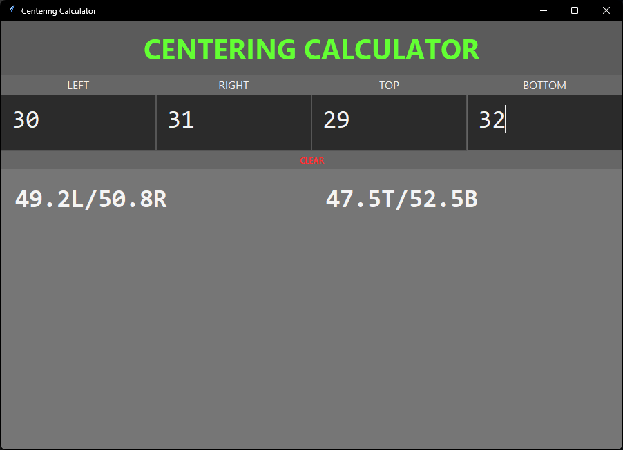

# Centering Calculator

A simple desktop calculator that converts left/right and top/bottom pixel measurements into percentage splits for centering. Built with Python and Tkinter, it updates results automatically as values are entered.

## Screenshot



## Features

- Live calculation as you type
- Left/Right percentage split output
- Top/Bottom percentage split output
- Simple desktop interface
- Clear button to reset all values

## Windows download

A compiled Windows version is available in the **Releases** section of this repository.

### How to use the EXE
1. Go to **Releases**
2. Download the latest `.zip`
3. Extract the `.zip`
4. Run the `.exe`

## How to run from source

Make sure Python 3 is installed, then run:

```bash
python centering_calculator.py
